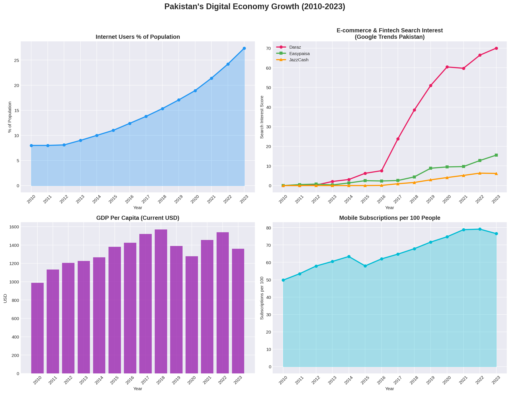
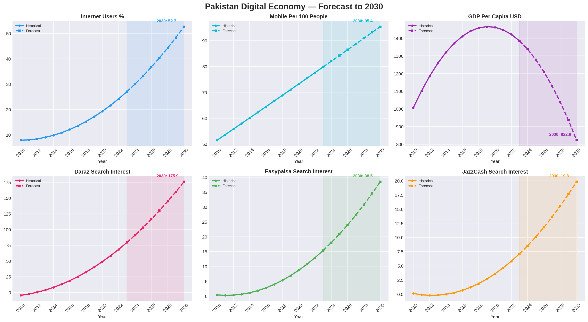

# Pakistan's Digital Economy: A Data-Driven Market Analysis (2010-2030)
### Tools: Python | Machine Learning | World Bank Data | Google Trends



## Project Overview
This project analyzes Pakistan's digital economy growth using real 
institutional data from the World Bank and Google Trends. Using 
polynomial regression forecasting, I project key digital indicators 
to 2030 and identify the optimal market entry window for global 
e-commerce and fintech companies.

This analysis directly addresses a $10 billion question:
> *"Is Pakistan ready for large-scale digital commerce — and when 
> is the right time to enter?"*

## Dashboard Preview


## Data Sources
- **World Bank Open Data** — Internet penetration, GDP per capita, 
  mobile subscriptions, population (2000-2023)
- **Google Trends Pakistan** — Search interest for Daraz, Easypaisa, 
  JazzCash, Online Shopping, Digital Payment (2004-2023)

## Key Business Insights

### 1. Internet Penetration Growing Exponentially
Pakistan's internet users grew **242% from 2010 to 2023** — from 
8% to 27.38% of population. Our model forecasts this reaching 
**52.66% by 2030** — meaning more than half of Pakistan's 247 
million people will be online.

### 2. E-commerce Interest Exploded After 2017
Daraz search interest grew from near zero in 2016 to a score of 
70 in 2023 — a **10x increase in 7 years.** Our model forecasts 
this reaching **175.94 by 2030** — signaling massive untapped 
e-commerce demand.

### 3. The GDP Paradox — Most Important Finding
```
GDP vs E-commerce correlation:      0.57 (weak)
Internet vs E-commerce correlation: 0.96 (near perfect)
```
**Digital adoption in Pakistan is infrastructure-driven, not 
income-driven.** This means e-commerce and fintech will continue 
growing even during economic downturns — as long as internet 
access expands. This is a critical insight for investors and 
market entry decisions.

### 4. Fintech Adoption Accelerating
Easypaisa search interest grew from 0 to 15.5 between 2010 and 
2023. JazzCash emerged in 2016 and reached 6.17 by 2023. Both 
are forecast to double by 2030 — signaling Pakistan's transition 
to a mobile payment economy.

### 5. Mobile Infrastructure Already Universal
Pakistan already has **76.54 mobile subscriptions per 100 people** 
— forecast to reach 95.41 by 2030. The infrastructure for 
mobile-first digital commerce already exists.

## Model Performance
| Indicator | R² Score |
|---|---|
| Internet Users % | 0.9988 |
| Easypaisa Search Interest | 0.9730 |
| JazzCash Search Interest | 0.9697 |
| Daraz Search Interest | 0.9424 |
| Mobile Subscriptions | 0.9302 |
| GDP Per Capita | 0.7818 |

## Strategic Recommendations
**Entry Window:** 2024-2027 is the optimal market entry period — 
when internet users cross 35%, triggering mass market adoption.

**Priority Sectors:** E-commerce, Digital Payments, EdTech, HealthTech

**Go-to-Market Strategy:**
- Mobile-first product design — Pakistan is already mobile-first
- Support Cash on Delivery + digital payments simultaneously
- Vernacular content in Urdu drives higher engagement
- Target 18-35 age group — 60% of Pakistan's population is under 30

## Project Structure
```
pakistan-digital-economy-analysis/
├── Pakistan_Digital_Economy_Analysis.ipynb  ← Main notebook
├── Pakistan_Digital_Economy.xlsx            ← Master dataset
├── pakistan_master_data.csv                 ← Clean merged data
├── pakistan_forecast_2030.csv               ← Forecast results
├── pakistan_digital_growth.png              ← Growth visualization
├── pakistan_forecast_2030.png               ← Forecast visualization
└── pakistan_correlation.png                 ← Correlation analysis
```

## Skills Demonstrated
- Data collection from real institutional sources
- Data cleaning and merging with Python Pandas
- Polynomial regression forecasting with Scikit-learn
- Correlation analysis and statistical interpretation
- Professional data visualization with Matplotlib and Seaborn
- Business insight communication and strategic recommendations
- Market entry analysis for emerging economies

## About This Analysis
This project was built to answer a real business question that 
global companies and investors ask every day — is Pakistan ready 
for digital commerce? The answer, backed by 13 years of real data 
and machine learning forecasting, is a clear yes — and the optimal 
window is right now.

*Analysis by Pakeeza atif — Data Analyst specializing in emerging 
market intelligence and digital economy analysis.*
